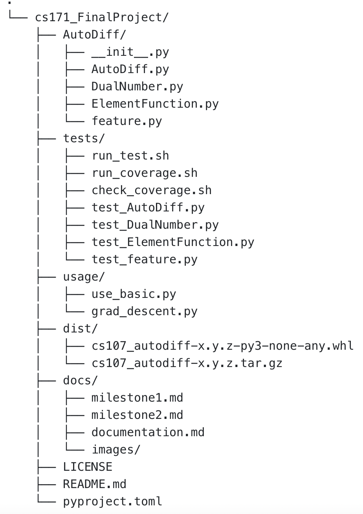
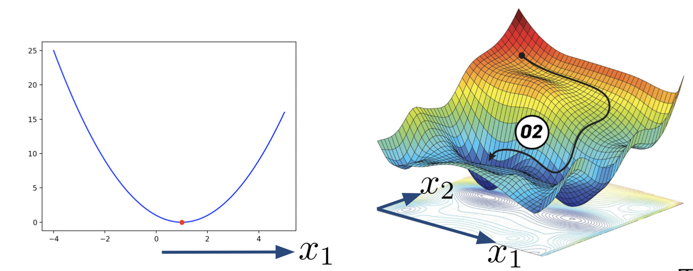

# Introduction
Differentiation is a critical component of modern computation. Ranging from the calculation the velocity fields of a dynamical equation to the back propagation when training neural networks, we need a robust and accurate algorithm to calculate the derivative.

This project will implement a Python package for automatic differentiation. The program will compute a value, and then automatically construct a procedure to evaluate the derivative of that value. Given a function of possibly several variables, the program can automate the calculation of its derivative. Automatic differentiation decomposes a large and complex problem into smaller sub-problems including elementary operations such as addition, subtraction, multiplication, division and elementary functions such as square root, exponential, and trigonometric functions. Furthermore, after decomposing the problem into more manageable chunks automatic differentiation repeatedly uses the chain rule to compute the derivative accurately to machine precision.

The significance of an automatic differentiation algorithm comes from its capability of calculating higher order derivatives, where numerical differentiation has problems of producing large and unstable numerical errors and high computational cost, and symbolic differentiation becomes extremely inefficient and produces redundant expressions as the function complexity increases. Therefore, developing an efficient, accurate, and robust program to compute derivative is crucial for the advancement of scientific computing. 

# Background
There are three major ways to compute the derivative of a function: numerical differentiation, symbolic differentiation, automatic differentiation. Numerical differentiation estimates the derivative of a function using finite difference approximation of the function at different points. Symbolic differentiation finds the derivative of a given formula with respect to a specified variable and output a new formula through manipulation of the mathematical expressions. [Automatic differentiation](https://en.wikipedia.org/wiki/Automatic_differentiation) is a set of techniques to evaluate the derivative of a function specified by a computer program.

Automatic differentiation (AD) is partly symbolic and partly numerical differentiation. It provides numerical values of derivatives, as opposed to derivative expressions; it does so by using symbolic rules of differentiation, but keeping track of derivative values as opposed to the resulting expressions. In comparison, pure numerical differentiation is the finite difference approximation of derivatives using values of the original function evaluated at some sample points.  Unlike traditional numerical differentiation that has problems of accuracy due to round-off and truncation errors, automatic differentiation is as accurate as symbolic differentiation with only a constant factor of overhead and support for control flow.

# How to use the package

## Installation
To install the package, a user shall have a Python version >= 3.7, `numpy` >= 1.20.3 and `matplotlib` >= 3.4.3 as the basic requirement. This package is Operating System independent. 

This package is released on TestPyPI [https://test.pypi.org/project/cs107-AutoDiff/] under the name "cs107-AutoDiff." The latest version is 1.0.4.

One can install the package by simply copying the following line in a Terminal:

```
python3 -m pip install --index-url https://test.pypi.org/simple/ cs107-AutoDiff
```
which will create a "AutoDiff" folder and a "cs107_autodiff-1.0.3.dist-info" folder in the directory of the user's default Python packages.

To import the package in Python, type the following lines:

```python
from AutoDiff.AutoDiff import AutoDiff as AD
from AutoDiff.AutoDiff import exam_user_function
from AutoDiff.ElementFunction import *
from AutoDiff.DualNumber import DualNumber
from AutoDiff.feature import grad_descent
import numpy as np
```

## A Basic User Demo

The following demo can also be found at [this Google Colab file](https://colab.research.google.com/drive/1BFW9qi9qCOP_leUnuvFrqv9OhWXcVxrK?usp=sharing). 

A user can create an `AutoDiff` object with a given mathematical function:

```python
>>> ### 1. Define your function
>>> f1 = lambda x, y: np.array([sin(x*y), exp(x) + y, y**2])

>>> ### 2. Create an AutoDiff object
>>> myAD = AD(f1)
>>> print(myAD) 
AutoDiff has a R^2 to R^3 function
```

And evaluate the function and its derivative with given variable values:

```python
>>> ### 3. Create x_vec, where its 1st component refers to x, and 2nd component refers to y in f1(x,y)
>>> x_vec = np.array([np.pi/2, 3])

>>> ### 4. Get the function value and gradient given the point of evaluation x_vec
>>> print(myAD(x_vec))
[1.0000000000000002, -2.828857481741469, -0.10793771827345966]
>>> print(myAD.grad(x)) 
[-1.          7.81047738  9.        ]
>>> print(f'The dimension of your Jacobian is {myAD.dim_f}x{myAD.dim_x}.\n')
The dimension of your Jacobian is 3x2.
>>> print(myAD.grad(x_vec))
[[-5.51091060e-16 -2.88550604e-16]
 [ 4.81047738e+00  1.00000000e+00]
 [ 0.00000000e+00  6.00000000e+00]]
```

Now, we can check the answer with the analytical solution:

```python
# the Jacobian matrix is expected to have the following form:
# [[y*cos(x*y), x*cos(x*y)],
# [exp(x)    , 1         ],
# [0         , 2*y       ]]
# where row refers to the i-th component of function f1(x,y), and column refers to j-th component of variable x_vec

# expected gradient value:
>>> print(np.array([[3*np.cos(np.pi/2*3), np.pi/2*np.cos(np.pi/2*3)], [exp(np.pi/2), 1], [0, 2*3]]))
[[-5.51091060e-16 -2.88550604e-16]
 [ 4.81047738e+00  1.00000000e+00]
 [ 0.00000000e+00  6.00000000e+00]]
```
<a name="gradientdescent">

## New Feature (Gradient Descent) Demo 

A user first defines an AutoDiff object with a 2D mathematical function:

```python
>>> ### 1. Define your 2D function
>>> f = lambda x, y: (sin(x-0.1))**2+(cos(y))**2

>>> ### 2. Create an AutoDiff object
>>> ADf = AD(f)
```

Then initialize a starting point: 
```python
>>> x0 = np.array([0.5, 0.2])
```

Get the x value corresponding to the nearest local minima:
```python
>>> x = grad_descent(f, x0, alpha=1e-4, converge_threshold=1e-8, verbose=True)
Iteration 0: x=[0.49992826 0.20003894], f(x)=1.112110519875897
Iteration 5000: x=[0.25425717 0.50368006], f(x)=0.790654332392609
....
Iteration 55000: x=[0.10000705 1.57071402], f(x)=6.8249389679983346e-09
```

Now we can check the result:
```python
>>> print(f"x={x} gives the minimum value of f(x)={ADf(x):.3f}")
>>> x=[0.10000427 1.57074652] gives the minimum value of f(x)=0.000
```
 </a>

## Use through Git Clone 
You can also use the package without installing it by cloning the repository from GitHub. Pasting the following line into your terminal:
  
  ```
  git clone git@code.harvard.edu:CS107/team41.git
  ```
Then, you may find the there is a `usage/` folder in the repository. You can start with basic features (getting the value of and the derivative of a function) with `use_basic.py`. You can try our additional feature such as doing gradient descent or reducing the loss in an objective function with `grad_descent.py`.  

Still, you need a Python version >= 3.7, `numpy` >= 1.20.3, and `matplotlib` >= 3.4.3 as the basic requirement.

# Software Organization
## High-level Overview of How the Software Is Organized:
  
  
There are 4 modules in this package: 
- `AutoDiff.py`: This module includes an AutoDiff class which allows the user to initialize an AutoDiff object **f** with a function $f(x_1,x_2,...,x_m):\mathbb{R}^m\mapsto\mathbb{R}^n$. The user then can use this object to calculate the value and derivative of that function on the input with given values of $[x_1,x_2,...,x_m]$ . 
   
- `DualNumber.py`: This module includes a DualNumber class, which allows the user to define a Dual Number object. 
   
- `ElementFunction.py`: This module contains functions such as **sin()**, **cos()**, **tan()**, **exp()** and **log()** that can be applied to Dual Number objects. 

- `feature.py`: This module contains the **grad_descent()** function that can perform gradient descent on a user input function and initial input value.

## Where Do Tests Live? How Do They run? How Are They Integrated?
  - Our test suite will live in a directory called `tests/`. The test suite is run with pytest and will run automatically through the CI setup configured in the `test.yml` file stored in the subdirectory called `.github/workflows`. We also have code coverage workflow set up in the `coverage.yml` file. The test coverage will pass if the coverage satisfies 90% or more and fail otherwise. The current test coverage is 100%.  

## How to Install the Package?

Please refer to the [installation](#installation) under "How to use the package".
  
# Implementation Details

There are four files that we use for our implementation: **AutoDiff.py**, **DualNumber.py**, **ElementFunction.py**, **feature.py**. We discuss each in detail:

- **AutoDiff.py**
  - The main functions of this class are:
    - `__call__` evaluates the function we pass in on a vector of inputs
    - `convert_to_dual` converts a list of ints or floats into a list of DualNumber objects
    - `grad` evaluates the gradient of a function on a vector of inputs. For the $1$-d case, the output is a vector. For multiple variables, the output is a Jacobian matrix.
    
- **DualNumber.py**
  - A DualNumber is a class with two attributes: **real (int/float)** and **dual (int/float)**. 
  - The main functions of this class are:
    - `check_type_convert` which converts ints and floats to a DualNumber with the same real part but with $0$ as the dual part
    - `__add__` and `__radd__` which enable DualNumber addition
    - `__sub__` and `__rsub__` which enable DualNumber subtraction
    - `__mul__` and `__rmul__` which enable DualNumber multiplication
    - `__truediv__` and `__rtruediv__` which enable DualNumber division
    - `__pow__` and `__rpow__` which enable DualNumber exponentation
    - `__eq__` and `__ne__` which compares equality of two DualNumbers
    - `__lt__` and `__le__` which compares if a DualNumber is less or less than or equal to another DualNumber
    - `__gt__` and `__ge__` which compares if a DualNumber is less or less than or equal to another DualNumber

- **ElementFunction.py**
  - The main functions of this class perform elementary operations on a list of DualNumbers or ints/floats:
    - `sin` is able to take in a list of ints/floats/DualNumbers and perform the `sin()` operation on each
    - `sinh` is able to take in a list of ints/floats/DualNumbers and perform the `sinh()` operation on each
    - `arcsin` is able to take in a list of ints/floats/DualNumbers and perform the `arcsin()` operation on each
    - `cos` is able to take in a list of ints/floats/DualNumbers and perform the `cos()` operation on each   
    - `cosh` is able to take in a list of ints/floats/DualNumbers and perform the `cosh()` operation on each   
    - `arccos` is able to take in a list of ints/floats/DualNumbers and perform the `arccos()` operation on each   
    - `tan` is able to take in a list of ints/floats/DualNumbers and perform the `tan()` operation on each
    - `tanh` is able to take in a list of ints/floats/DualNumbers and perform the `tan()` operation on each
    - `arctan` is able to take in a list of ints/floats/DualNumbers and perform the `arctan()` operation on each
    - `exp` is able to take in a list of ints/floats/DualNumbers and perform the `exp()` operation on each
    - `log` is able to take in a list of ints/floats/DualNumbers and perform the `log()` operation on each
    - `log10` is able to take in a list of ints/floats/DualNumbers and perform the `log10()` operation on each
    - `logBase` is able to take in a list of ints/floats/DualNumbers and perform the `logBase()` operation on each
    - `sqrt` is able to take in a list of ints/floats/DualNumbers and perform the `sqrt()` operation on each   
    - `logistic` is able to take in a list of ints/floats/DualNumbers and perform the `logistic()` operation on each

- **feature.py**
    - The main function of this class executes the gradient descent for an input function.
        - `grad_descent` is able to take in a function, an initial guess value (either scalar or 1D array), a learning rate alpha, a maximum number of iterations, a convergence threshold, and a "verbose" option to print the intermediate results and visualize the process. It performs the gradient descent and returns the variable value that either gives the minimum of the function or returns when the maximum number of iterations is reached.

For exponentials, please use the dunder method `__pow__` with the `**` operator. You can raise real-valued numbers to Dual Numbers and also raise Dual Numbers to real-valued powers. You can also raise Dual Numbers to Dual Numbers with this operator.

We have also implemented automatic differentation for one or multiple variables via Jacobian matrices. Our `AutoDiff` implementation is able to differentiate one-dimensional scalars. To differentiate one or more variables, we implemented this by applying our `AutoDiff` in a setup where we would treat all the variables we were not taking the derivative with respect to as scalars. Then, we would run our `AutoDiff` as we typically have done in the one-dimensional scalar setup.

<!-- This involves setting the `dual` attribute of the DualNumber equal to an integer or float or a `numpy` array. For instance, if we have $x_1$ and $x_2$, we have two passes of the seed vector $[1, 0]$ and $[0, 1]$ where the first vector is with respect to $x_1$ and the second with respect to $x_2$. -->
  
# Our extension
## New feature from Milestone 2 & Its Feedback
* Advanced Functionalities: add new functionalities to the package, such as handling multiple datasets, different types of inputs, computation speedup, expanding the types of the elementary functions etc. 
* Neural Network Class: implement a neural network class that can be used to setup a neural network model.
* Package Tutorial: write a Google Colab tutorial with some examples which help people learn to use this package faster. It will include content on how to install the package, how to use the functionalities, how to do back propagation and gradient descent in a neural network. For the final step, we will include some activation functions into the elementary function class. 

Feedback: 
- Future Features (-1):
Please be reasonable about your workload given the remaining time. Just choose one direction to explore. And I hope to have more details about your target plan. You should choose either the direction of application (e.g. optimization, similar to grad desc) or implementation (e.g. reverse mode).

Update: We choose to focus on application here, in particular Gradient Descent, due to its widespread use.

## Gradient Descent

In mathematics, gradient descent is a first-order iterative optimization algorithm for finding a local minimum of a differentiable function. This feature will require the user to input a scalar function $f(\vec{x}): \mathbb{R}^n \to \mathbb{R}$ with an initial guess $\vec{x_0}$, and then it will output the value of $\vec{x}$ corresponding to the local minimum of $f$. As shown in the graph below, this feature is applicable to a higher dimensional space. Please refer to [New Feature (Gradient Descent) Demo](#gradientdescent) under "How to use the package" on how to use this feature.

In addition, the user can tune this method based on their own choice of learning rate `alpha`, convergence criteria `converge_threshold`, and maximum iteration `max_iter`. If `verbose=True`, the method will print out info about $\vec{x}$ and $f(\vec{x})$ every a few hundred iterations during the gradient descent process. Please note that the output may vary if the function has multiple local minimas and the user pick different initial guesses. 



- **Gradient**: $\nabla f(\vec{x_i})$ points to the direction of maximum
- **Update**: $\vec{x_{i+1}} = \vec{x_i} - \alpha \nabla f(\vec{x_i})$, where $\alpha$ is the learning rate
- **Starting**: initial guess $\vec{x_0}$
- **Stopping Condition**:
    - 1. $\vec{x_{i+1}}-\vec{x_i} <$ convergence_threshold
    - 2. reach maximum iteration

```python
def grad_descent(function, x0, alpha=1e-5, max_iter=int(1e6), converge_threshold=1e-8, verbose=False):
    """Gradient descent algorithm for finding the minimum of a function.
```

# Broader Impact and Inclusivity Statement

- **Broader Impact**: Automatic differentation is a far-reaching and profound tool that can be utilized in some way, shape, or form by scientists across the world. It can be used in training deep neural networks where one must continually compute the derivative of the loss function with respect to the weights for tasks like image classification or sentiment analysis, modeling differential equations to understand better fluid dynamics and different physical properties of liquids and gas we observe in the real world, and even practically in social sciences like economics where it is crucial to compute exact and precise measurements related to investment gains or losses. Everyone is able to take this software for replication or to improve upon it on their own. We stress though that this must be done in an ethical and transparent manner. Changes that ones make to the software should not substantially deter or prevent disadvantaged groups from contributing to the software in the future. For example, if one decides to adds new functions or tools to the software, it is paramount that one documents how and why they added to the existing software, and how one in the future is able to utilize these new tools. Furthermore, every change, however trivial, must be documented exactly. In order to promote a responsible and ethical environment, science empowers work to be made repeatable for anyone else to completely replicate.

- **Inclusitivity**: Our team designed `AutoDiff` to be as inclusive and accessible to the broader community as possible. Everyone who contributes to the package or interacts with it must respectful and inclusive to everyone else using it at all times. We have a zero-tolerance policy on racism, sexism, ageism, or discimination of any kind against users using this package. We welcome a diverse and well-rounded set of opinions, fostered by continual discussion and respectful constructive criticism in improving the package. We encourage users to constantly ask questions about decisions made in the package in a respectful manner. We believe anyone, regardless of background, race, or gender, can contribute to the package in a meaningful and significant way. Pull requests will be evaluated anonymously by at least two developers to lessen any kinds of bias we may have, like unconscious bias or confirmation bias. All text must be understandable by non-native English speakers. Documentation must be clear and concise. Additionally, we have a zero-tolernace policy towards ethical or disciminatory uses of the package.

# Future Feature: Neural Network Class
In our future updates of this package, we are planning to include features to train a neural network. In every neural network, there are many weights that connect neurons between different layers. In a learning process, performance of the neural network is improved by finding the optimal weights. Neural networks are able to gradually increase accuracy with every training session, this can be accomplished  by the process of gradient descent.

 
 
To achieve this in our future version, we will construct a multi-layer neural network, similar to what we did in pair programming of this course.  As we mentioned earlier, in gradient descent algorithm, our goal is to minimize the objective function of a differentiable function, which in this case is the loss function of the neural network. Since we’ve included gradient descent in our current version, we are just one step away from applying it to optimize the loss on a neural network.

Below is an overview of the neural network training in an optimization setup. 

 ## Train a Neural Network
 - **Objective Function**: Loss Function $\mathcal{L}(\vec{\omega_i}, \vec{x}, \vec{y})$
 - **Parameters**: 
    - $\vec{\omega_i}$, weights vector in iteration $i=1,2,\cdots,n$
    - $\alpha$, learning rate
- **Variables**: ${\vec{x}, \vec{y}}$, training dataset
- **Iterative Algorithm**: $\vec{\omega_{i+1}}=\vec{\omega_i}-\alpha \nabla_{\vec{\omega}}\mathcal{L}(\vec{\omega_i}, \vec{x}, \vec{y})$

Our objective loss function $L$, takes in a training data set {$x$,$y$} and a weight vector $\vec{\omega}$ that consists of the weights of all layers in the network. The goal of a learning process for a given training dataset is to update weight vector to minimize $L$.

With an initial guess, we need to iteratively update weight vector until it converges, which indicates minimum loss function achieved. This iterative algorithm can be achieved by using the gradient descent method, which we already had in the current version.
